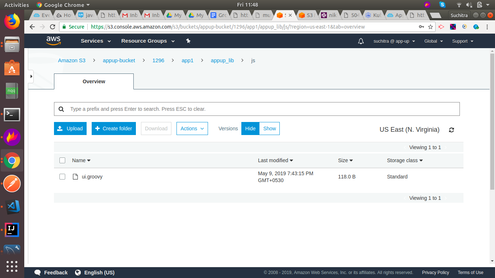
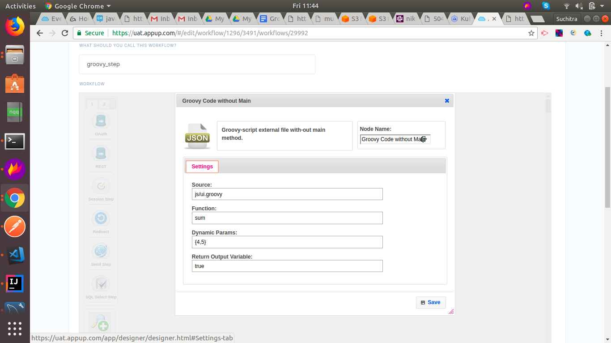

**Groovy Step**:

Groovy step is used to execute the functions that are present. As of now
we are placing this groovy file in
appup-bucket/{{cloud\_id}}/{{app\_name}}/appup\_lib/js folder.

Navigate to Workflows-Add More-Developers.Use the Groovy Code Main
Method.

**Screenshots:**

