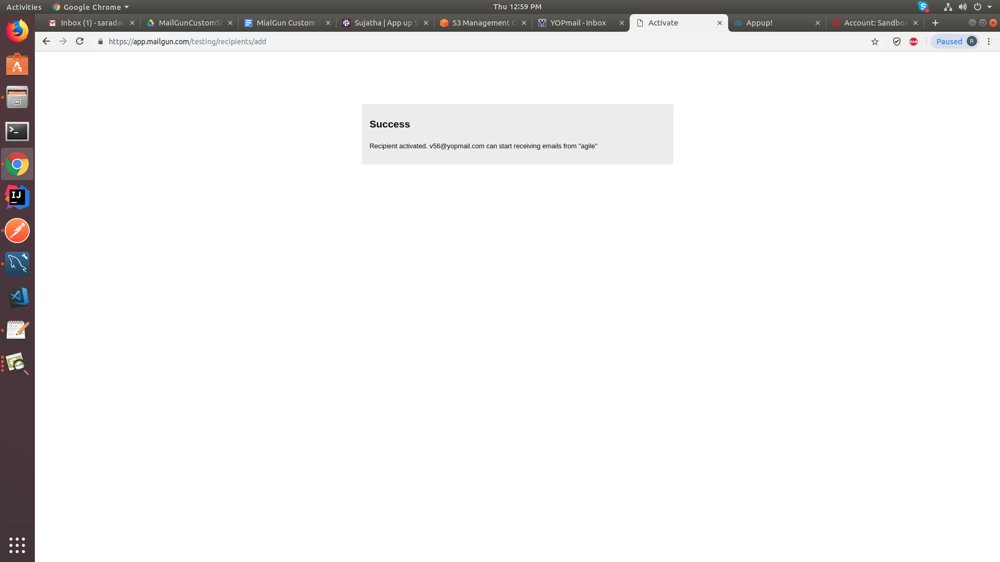

**MailGun Custom Step**

**Functionality:** It is used to send email to authorized recipients. We
can send an email with a single attachment and also with multiple
attachments to authorized users.

**Technical Details: **

W1(mailgun custom step): This workflow should send an email to the
authorized mail ids which are there in mailgun account.

In this workflow, we are providing an attachment from the s3 bucket.

We can also use box API file download and also onedrive file download
step for attachments.

In this mailgun custom step, we need to provide API key and host as
sandbox name from your mailgun account.

Once we run the published URL in postman it will send an email to
authorized users.

**Reference Links for MailGun:**

1.Create an account in mailgun -
[*https://app.mailgun.com/*](https://app.mailgun.com/)

2.You will receive a link to your email. Please, login through that
link.

3.Click on domains and you can find sandbox account name click on that
sandbox account you can find API key.

4.Use sandbox account name as Host

5.Mailgun account API key as API key in Mailgun Custom Step.

6.To send an email through mailgun we have to add emails in Mailing List
to subscribe to mailgun account.

[*https://snag.gy/5wu4zk.jpg*](https://snag.gy/5wu4zk.jpg)

8.You can only send an email to subscribed mail ids.

**PostMan Collections: **

[*https://www.getpostman.com/collections/8507d13d776eabf21bb4*](https://www.getpostman.com/collections/8507d13d776eabf21bb4)

**Screenshots:**

Create an account in mailgun

It will send an verification link to your mail id.Please login through
that link.

It will ask your mobile verification.Please, provide a valid mobile
number

Login to mailgun account

Click on Domain for host and apikey

Adding recipients

Click on email validation

click on upgrade it will redirect to a page click on invite new
recipients

Add respective emails here

Here your mail is unverified . please login to your email which we added
in maillist

Now your mail was verified. You can send mails to this verified mail id
through mailgun custom step.

**Credential:**

Url: our.appup.com

Username: [*v56@yopmail.com*](mailto:v56@yopmail.com)

Password: 123456

Cloud : v56

App: mailgun

Mailgun custom step node:

To verify the output run the published url in postman and then verify
your mail.

