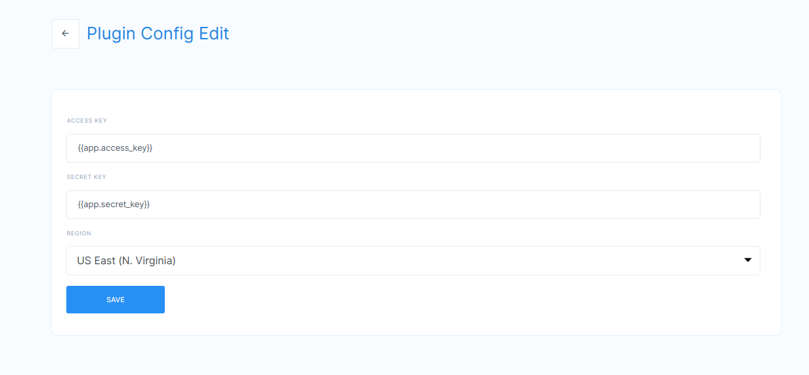
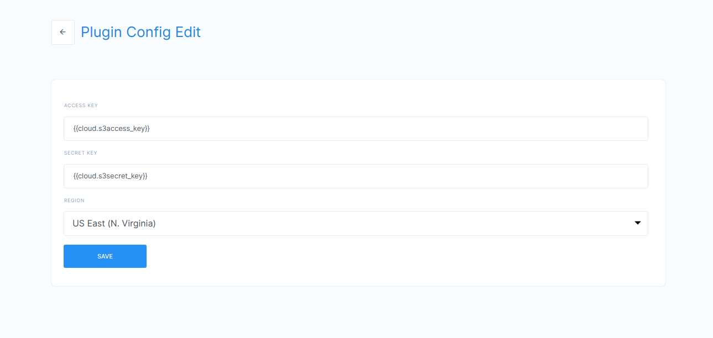

**Plugin Templatization**

**Functionality:** Plugin templatization is used to provide plugin keys
like access key, secret key, API key, username, password and schema
through cloud and app properties.

Plugin templatization concept is to hide the plugin details while coping
app from the marketplace. After coping app from marketplace end users
can provide their own plugin keys by using this app and cloud
properties.

App-level properties mean plugin details are used for that particular
app only.

Cloud level properties mean plugin details which are provided in cloud
properties can be used for all the apps int hat cloud.

**Technical Details:**

WF1: created workflow with s3 file download node and while installing a
plugin for s3 I used app properties.

Syntax: {{app.&lt;key&gt;}}

WF2: Created different app and workflow with s3 file download node,
while installing a s3 plugin I used cloud properties.

Syntax: {{cloud.&lt;key&gt;}}

Cloud properties can be used for a different app within the same cloud.

applevel

Cloud level

**Video:**
[*https://drive.google.com/file/d/1ShgoJ-NtI21H12bAUU3nG-ZP4Lskomqi/view*](https://drive.google.com/file/d/1ShgoJ-NtI21H12bAUU3nG-ZP4Lskomqi/view)
